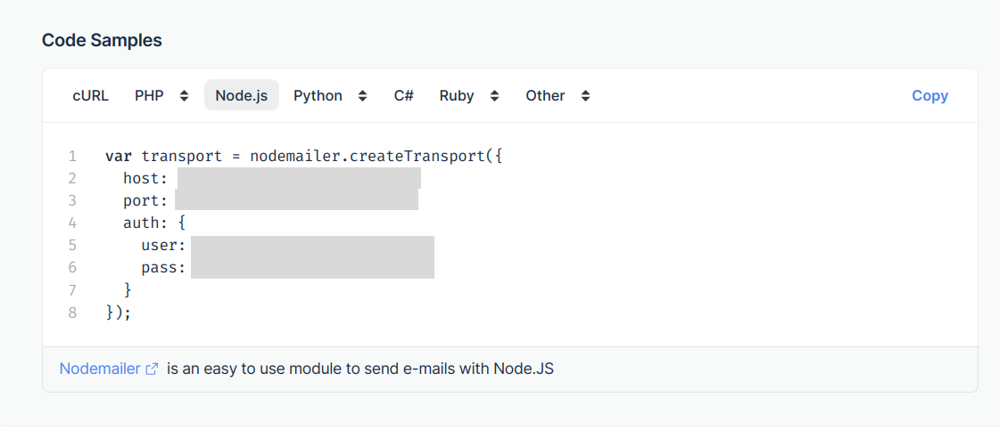
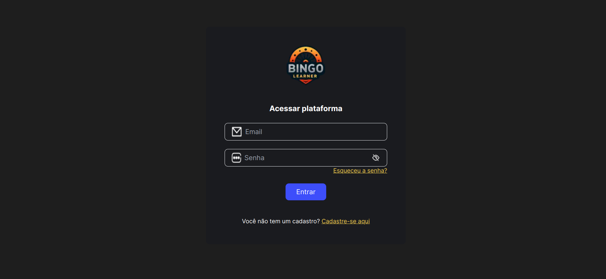
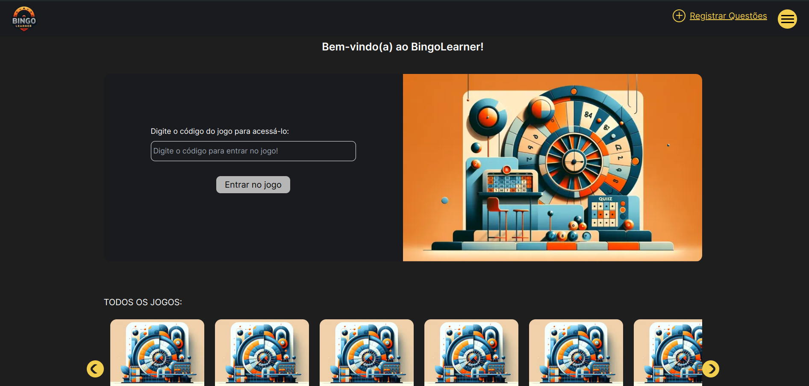
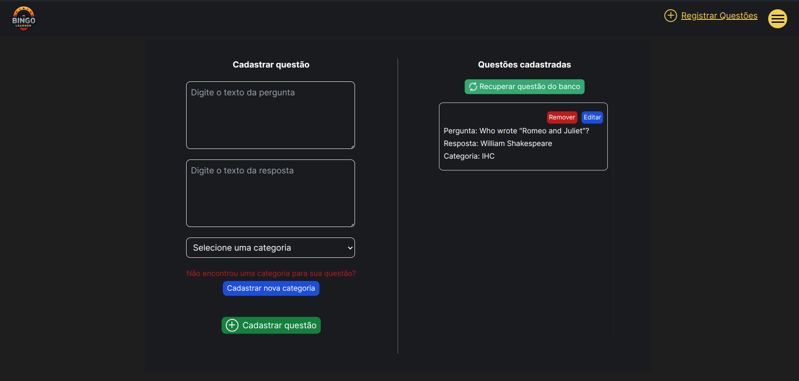
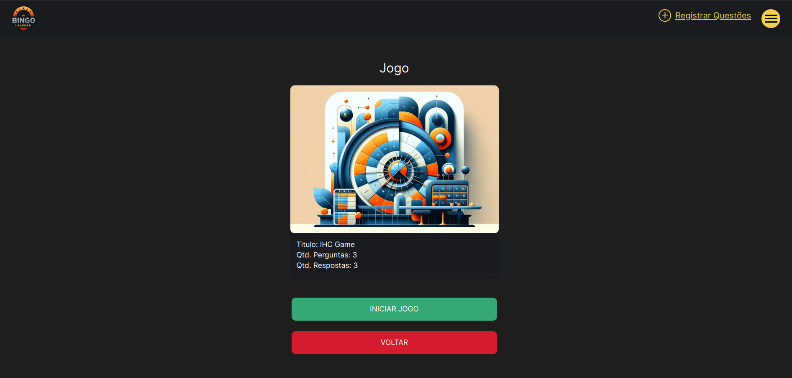
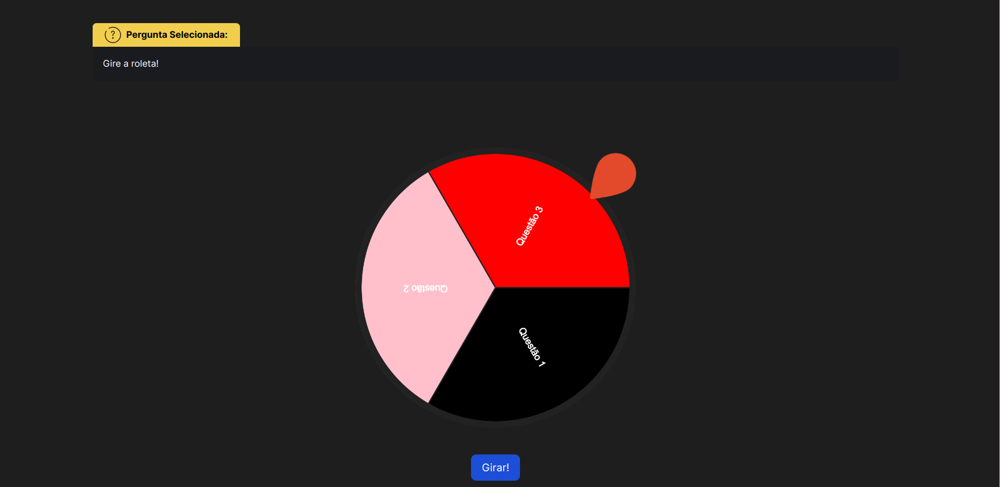

# Bingo Educacional

Bingo Educacional é um projeto desenvolvido para a disciplina de Tópicos Avançados em IHC e Engenharia de Software Educacional da faculdade. Este projeto utiliza Next.js no front end e Laravel no back end.

## Índice

- [Sobre](#sobre)
- [Instalação](#instalação)
- [Uso](#uso)
- [Funcionalidades](#funcionalidades)
- [Imagens](#imagens)
- [Protótipo](#protótipo)
- [Documentação](#documentação)

## Sobre

O Bingo Educacional é uma ferramenta interativa desenvolvida para auxiliar no processo de ensino-aprendizagem através de um jogo de bingo. Este projeto foi realizado como parte das disciplinas de Tópicos Avançados em IHC e Engenharia de Software Educacional, com o objetivo de aplicar conceitos teóricos na prática e promover a gamificação na educação. Devido à greve dos professores nos Institutos Federais do Brasil em 2024, houve mudanças significativas entre o protótipo inicial e o desenvolvimento final do projeto.

## Tecnologias Utilizadas

- **Next.js:** Framework React para desenvolvimento de aplicações web.
- **Outras tecnologias:** Back-end desenvolvido em Laravel ([link para o repositório](https://github.com/Gustavo-Henrique-Lima/BingoEducacional))

## Instalação

Siga as instruções abaixo para configurar e executar o projeto localmente.

Antes de iniciar essa instalação, é recomendado que você já tenha acessado e seguido o tutorial de instalação do back end do projeto

```bash


# Clone o repositório
git clone https://github.com/EversonDoNascimento/FrontBingoEducacional.git

# Entre no diretório do projeto
cd FrontBingoEducacional
```

Para cadastrar, ativar usuários e recuperar senha, será necessário utilizar um simulador de servidor SMTP.

Recomendamos o mailtrap.io. Faça o cadastro no site mailtrap.io para obter suas credenciais SMTP.



As informações que você irá precisar são as seguintes:

- host
- port
- user
- pass

```bash
# Renomeie o arquivo .env.local para .env
mv .env.local .env

# Abra o arquivo .env para edição
nano .env
```

Altere a variável API_URL de acordo com a URL onde o back-end do projeto está rodando

- Ex.: http://127.0.0.1:8000/api

Configure as variáveis USER_EMAIL, USER_PASS, EMAIL_HOST, EMAIL_PORT com as informações do seu servidor SMTP do mailtrap.io.

Preencha as variáveis com as informações de user, pass, host e port respectivamente.

A variável FROM_EMAIL pode ser configurada como bingoeducacional@gmail.com

Salve as alterações no nano com "Ctrl + o", pressione Enter para confirmar e saia do editor com "Ctrl + x".

```bash

# Instale as dependências
npm install

# Inicie a aplicação
npm run dev
```

Se tudo estiver configurado corretamente, os emails chegarão na caixa de emails do mailtrap.io.

## Uso

Para usar o projeto após a instalação, abra http://localhost:3000 no seu navegador para ver o projeto em ação.

## Funcionalidades

- Jogo de bingo interativo para fins educacionais
- Interface amigável e intuitiva
- Adaptável conforme a disciplina que será utilizado

## Imagens







## Protótipo

- [Figma do projeto](https://www.figma.com/design/rL9BylzBv3Uwx5YU30Z1PO/Projeto-IHC-%2B-ESE?node-id=0-1&t=IS7pDtYlwVJYlAbn-0)

## Documentação

Em breve
